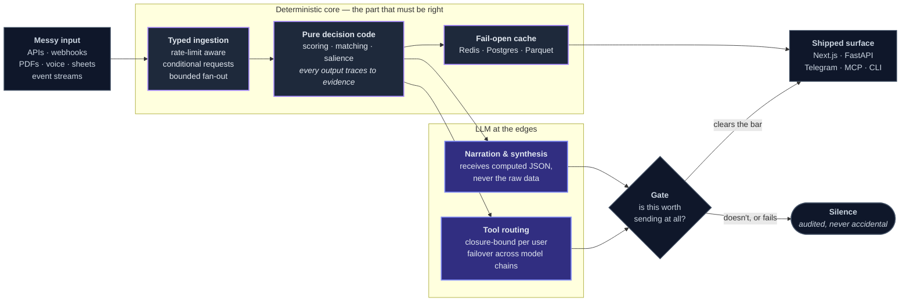
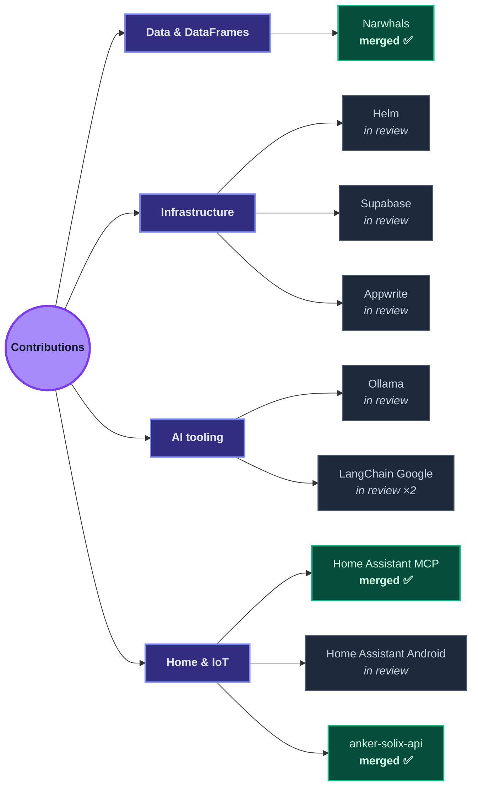

<!-- ════════════════════════ HEADER BANNER ════════════════════════ -->

<!-- ════════════════════════ ROLE PILLARS ════════════════════════ -->

**Agentic AI Systems** &nbsp;·&nbsp; **AI/ML Engineering** &nbsp;·&nbsp; **RAG &amp; LLM Applications** &nbsp;·&nbsp; **Python Backends** &nbsp;·&nbsp; **Data Engineering**

<!-- ════════════════════════ TYPING SUBTITLE ════════════════════════ -->

<!-- ════════════════════════ SOCIAL BADGES ════════════════════════ -->

 

<!-- ════════════════════════ ABOUT ME ════════════════════════ -->
##  About Me

I'm an **Agentic AI & Systems Engineer** who likes owning a problem end-to-end, from the data and the retrieval layer through the model to the product people actually use.

- 🔭 I build **autonomous Python pipelines**, **PySpark / Databricks lakehouses**, and **RAG / LLM systems**: then ship them as full-stack apps with **Next.js & FastAPI**.
- 🧩 Deepest in **agents, RAG and Python backends**, with real range across **data engineering and full-stack** when the problem needs it.
- 🎓 **B.Tech CSE, Class of 2026** (graduated). Earned an **M.Tech CSE seat at IIIT Tiruchirappalli** and turned it down to build full-time.
- ⚡ I default to **free, production-grade tooling**: most of my projects run at **~$0/month**.
- 📫 **Open to AI / ML / Backend roles, right now.** Let's talk: **shaansatsangi@gmail.com**

 

<!-- ════════════════════════ HOW I BUILD ════════════════════════ -->
## 🧭 How I Build

The same spine runs through almost everything below: **the model writes the prose, never the number.** Decisions live in code that can be tested; the LLM narrates, routes, and asks for clarification around it. Every layer fails open, except the gates, which fail closed.

**Where each piece is real, not aspirational:** the deterministic core is [Skill Issue](https://github.com/Shaan-alpha/Skill-Issue)'s two-pass scorer · the gate is [Atlas](https://github.com/Shaan-alpha/atlas-financial-assistant)'s salience check, which returns `send: false` and means it · closure-bound routing is Atlas's 20 tools, each welded to one user id · fail-open caching is Skill Issue's four Redis layers.

 

### What I work on, and what proves it

```mermaid
flowchart TD
    ME(("<b>Shaan</b>"))

    ME --> A["<b>Agentic AI</b>"]
    ME --> B["<b>RAG &amp; retrieval</b>"]
    ME --> C["<b>Python backends</b>"]
    ME --> D["<b>Data engineering</b>"]

    A --> A1["<b>Atlas</b> — 20 tools under Gemini<br/>function calling, live on Telegram"]
    A --> A2["<b>Syntrueno</b> — agent swarm that mutates<br/>real Cloud Run behind a human gate"]
    A --> A3["<b>telegram-mcp</b> — MCP server giving<br/>agents your own Telegram account"]

    B --> B1["<b>Think9 Brain</b> — cites its source section,<br/>refuses when the corpus can't answer"]
    B --> B2["<b>disaster-management-rag</b> — 18/20 held-out,<br/>reproducible with no API key"]
    B --> B3["<b>JARVIS-PY</b> — semantic memory +<br/>threshold-gated PDF RAG, fully local"]

    C --> C1["<b>Skill Issue</b> — FastAPI, Neon, Upstash,<br/>OAuth, warm p95 ≤ 200 ms"]
    C --> C2["<b>VouchRank</b> — multi-tenant SaaS on<br/>Postgres RLS + 12 Deno edge functions"]

    D --> D1["<b>YouTube Wrapped</b> — Databricks medallion<br/>lakehouse on Delta Lake"]
    D --> D2["<b>CRM Sales Warehouse</b> — Airflow-orchestrated<br/>star schema, dbt-tested, Power BI"]

    classDef root fill:#a78bfa,stroke:#7c3aed,stroke-width:3px,color:#0f172a
    classDef pillar fill:#312e81,stroke:#818cf8,stroke-width:2px,color:#e2e8f0
    classDef proof fill:#1e293b,stroke:#475569,stroke-width:1.5px,color:#cbd5e1
    class ME root
    class A,B,C,D pillar
    class A1,A2,A3,B1,B2,B3,C1,C2,D1,D2 proof
```

 

<!-- ════════════════════════ FEATURED PROJECTS ════════════════════════ -->
## 🚀 Featured Projects

<table>
<tr>
<td width="50%" valign="top">

### 📈 [Atlas](https://github.com/Shaan-alpha/atlas-financial-assistant) &nbsp;·&nbsp; [**▶ Talk to it**](https://t.me/AtlasAnalyst_bot)
`AI Agent` · `Fintech` · `Backend`

An **AI financial analyst that lives in Telegram**: conversation only, no slash commands or buttons. Learns you as you talk, pulls live quotes and fundamentals through an **eight-provider failover chain** (five quote, three fundamentals), reads PDFs and spreadsheets natively (tables stay tables), transcribes voice notes, and sends a morning briefing *only* when something on your watchlist matters; silence is enforced control flow, not a prompt suggestion.

**Gemini function calling** drives the loop across **20 tools**, each closure-bound to one user so the model cannot reach another's data. Always-on under `systemd` with a polling watchdog that force-exits a bot which is up but no longer listening: back serving **six seconds after `kill -9`**. 191 tests.

[**▶ Talk to it**](https://t.me/AtlasAnalyst_bot) · [**Code**](https://github.com/Shaan-alpha/atlas-financial-assistant)

</td>
<td width="50%" valign="top">

### ⚡ [Skill Issue](https://github.com/Shaan-alpha/Skill-Issue)
`Full-Stack` · `AI` · `Production`

Reads any public GitHub profile and scores it **out of 100** across six weighted signals, then places you on a **7-tier ladder** from Hobbyist to Principal with a sub-rank. Every point traces to real evidence in your repos; the AI writes the *narrative*, never the numbers (**0 hallucinated scores**). Pick **Roast Mode** for what a blunt senior would say, or **Mentor Mode** for how to fix it. Free, no signup; sign in to save reports and share them.

> It scored me **81/100: Staff Engineer**, nine points off Principal, then roasted me for it.

[**Live**](https://skillissue.tech) · [**Code**](https://github.com/Shaan-alpha/Skill-Issue)

</td>
</tr>
<tr>
<td width="50%" valign="top">

### 💬 [VouchRank](https://github.com/Shaan-alpha/vouchrank) &nbsp;·&nbsp; [**▶ Live Demo**](https://vouchrank.vercel.app)
`Full-Stack` · `SaaS` · `AI`

Multi-tenant, white-label **reputation + AI-search-optimization SaaS**: a compliance-first review funnel (FTC / Google 2026 review rules), **LLM-visibility audits** (ChatGPT · Gemini · Perplexity), embeddable social-proof widgets, **Stripe** subscriptions + billing portal, and **Supabase Postgres Row-Level Security** tenant isolation across 12 Deno edge functions; fully clickable live in demo mode.

[**▶ Live Demo**](https://vouchrank.vercel.app) · [**Code**](https://github.com/Shaan-alpha/vouchrank)

</td>
<td width="50%" valign="top">

### 🎬 [AI Reel Factory](https://github.com/Shaan-alpha/AI-Reel-Factory)
`AI/ML` · `Data Eng` · `Automation`

Fully autonomous, **~$0/month** pipeline that researches news, writes & narrates scripts in a near-human voice, generates AI B-roll, auto-edits a captioned cinematic vertical video, and publishes daily YouTube Shorts: **one Telegram tap** is the only human input.

[**▶ Watch**](https://youtube.com/@butitmatters) · [**Code**](https://github.com/Shaan-alpha/AI-Reel-Factory)

</td>
</tr>
<tr>
<td width="50%" valign="top">

### 📊 [YouTube Wrapped](https://github.com/Shaan-alpha/Youtube-Wrapped)
`Data Eng` · `Analytics`

Personal watch-history analytics product built on a **Databricks medallion lakehouse** (Bronze → Silver → Gold) over Delta Lake, served through a deployed **FastAPI + Next.js** dashboard.

[**Code**](https://github.com/Shaan-alpha/Youtube-Wrapped)

</td>
<td width="50%" valign="top">

### 🏗️ [CRM Sales Warehouse](https://github.com/Shaan-alpha/CRM-Sales-Warehouse)
`Data Eng` · `Analytics`

End-to-end CRM analytics platform: Python **ETL/ELT** into a star-schema **PostgreSQL** warehouse, orchestrated with **Airflow**, validated with **dbt tests**, and surfaced as a 5-page **Power BI** executive dashboard.

[**Code**](https://github.com/Shaan-alpha/CRM-Sales-Warehouse)

</td>
</tr>
<tr>
<td width="50%" valign="top">

### 🧠 [JARVIS-PY](https://github.com/Shaan-alpha/jarvis-py)
`AI/ML`

Local-first AI **voice assistant** with wake-word barge-in, online/offline STT, **semantic memory**, **PDF RAG**, tool-agent routing, reminders, and interruptible TTS; privacy-first, runs on your machine.

[**Code**](https://github.com/Shaan-alpha/jarvis-py)

</td>
<td width="50%" valign="top">

### 🛡️ [Sahaara](https://github.com/Shaan-alpha/Sahaara_APP)
`Full-Stack`

Safety-focused full-stack app with gesture-based **emergency SOS**, **MapLibre** live location sharing, trusted contacts, and **Twilio** SMS alerts; built for fast, reliable real-world response.

[**Code**](https://github.com/Shaan-alpha/Sahaara_APP)

</td>
</tr>
<tr>
<td width="50%" valign="top">

### 🛰️ [Syntrueno](https://github.com/Shaan-alpha/syntrueno) &nbsp;·&nbsp; [**▶ Live service**](https://syntrueno-18489510475.us-central1.run.app)
`Agentic AI` · `Zero-Trust` · `GCP`

A **zero-trust autonomous cloud-ops swarm**. Gemini agents diagnose live incidents, propose remediations, judge their own plans for safety, and: behind a **single-use SHA-256 human gate bound to that exact action**: execute real changes against real Cloud Run infrastructure, then re-read live state until it converges rather than trusting the API's acknowledgement.

Five guards fail closed, cheapest first. Every refusal is audited into a **hash-chained Firestore ledger**, never silent. **113 tests** run offline in ~0.9 s with no credentials.

[**▶ Live**](https://syntrueno-18489510475.us-central1.run.app) · [**Code**](https://github.com/Shaan-alpha/syntrueno)

</td>
<td width="50%" valign="top">

### 🧾 [Think9 Brain](https://github.com/Shaan-alpha/think9-brain) &nbsp;·&nbsp; [**▶ Live**](https://think9-brain.vercel.app)
`RAG` · `LangGraph` · `Retrieval`

A grounded **institutional-memory assistant** that cites the exact source section, states a good-as-of date, and holds back superseded documents. Built to be *trusted*, which means built to say "I don't know."

**Refusal recall is 1.000 on both eval sets**: across 32 unanswerable questions (invented vendors, plausible-but-absent figures, out-of-scope functions) it never once fabricated an answer.

[**▶ Live**](https://think9-brain.vercel.app) · [**Code**](https://github.com/Shaan-alpha/think9-brain)

</td>
</tr>
</table>

**More:** [telegram-mcp](https://github.com/Shaan-alpha/telegram-mcp) (MCP server for your own Telegram account) · [Face Sort Studio](https://github.com/Shaan-alpha/Face-Sort-Studio) (local CV photo organizer) · [Cog & Cosmos](https://github.com/Shaan-alpha/Cog-and-Cosmos) (Svelte/PixiJS idle game) · and [browse all repos →](https://github.com/Shaan-alpha?tab=repositories)

 

<!-- ════════════════════════ OPEN SOURCE ════════════════════════ -->
## 🌐 Open Source

Shipping into other people's codebases, where the review bar isn't mine to set.

**Merged upstream**

| PR | Project | What it fixed |
| :--- | :--- | :--- |
| [narwhals#3697](https://github.com/narwhals-dev/narwhals/pull/3697) | **Narwhals** · 1.7k ⭐ | Added a `maintain_order` argument to `Expr.list.unique` / `Series.list.unique`, across the backend implementations |
| [ha-mcp#1670](https://github.com/homeassistant-ai/ha-mcp/pull/1670) | **Home Assistant MCP** · 4.5k ⭐ | A restart through a reverse proxy returned 502/503 and was read as a failure; the known-good patterns now cover it |
| [anker-solix-api#314](https://github.com/thomluther/anker-solix-api/pull/314) | **anker-solix-api** · 291 ⭐ | Extended X1 device support by updating the status enumerations |

**Open, in review**

| PR | Project | What it does |
| :--- | :--- | :--- |
| [ollama#16715](https://github.com/ollama/ollama/pull/16715) | **Ollama** · 179k ⭐ | Fixes CLI image-path parsing bugs |
| [supabase#46915](https://github.com/supabase/supabase/pull/46915) | **Supabase** · 108k ⭐ | Allows newlines in the SMS OTP template string in Studio |
| [appwrite#12597](https://github.com/appwrite/appwrite/pull/12597) | **Appwrite** · 57k ⭐ | Allows a null `name` parameter on the user-creation endpoints |
| [helm#32250](https://github.com/helm/helm/pull/32250) | **Helm** · 30k ⭐ | Surfaces the installed chart's source location |
| [android#7018](https://github.com/home-assistant/android/pull/7018) | **Home Assistant Android** · 3.8k ⭐ | Refactors the media-player widget config activity to Compose + Material 3 |
| [langchain-google#1950](https://github.com/langchain-ai/langchain-google/pull/1950) · [#1840](https://github.com/langchain-ai/langchain-google/pull/1840) | **LangChain Google** · 400 ⭐ | Stops the spurious `$defs` warning on converted schemas; migrates the integration tests to async |

 

<!-- ════════════════════════ TECH STACK ════════════════════════ -->
## 🛠️ Tech Stack

**🗄️ Data Engineering & Analytics**

**🤖 AI / ML**

**💻 Full-Stack**

**☁️ DevOps & Cloud**

<b>+ more tools I reach for</b>

 

 

<!-- ════════════════════════ CURRENTLY ════════════════════════ -->
## 🎯 What I'm Up To

- 🛰️ Built **[Syntrueno](https://github.com/Shaan-alpha/syntrueno)** for the Google Cloud "All Things Agentic" Hackathon: an agent swarm that makes real infrastructure changes behind a cryptographic human gate. [Live on Cloud Run](https://syntrueno-18489510475.us-central1.run.app).
- 🚀 Shipping **[Skill Issue](https://github.com/Shaan-alpha/Skill-Issue)** at [skillissue.tech](https://skillissue.tech) — currently **v1.0.11**. Scores any GitHub profile out of 100, roasts it, and hands you the receipt. Free, no signup.
- 📈 Running **[Atlas](https://github.com/Shaan-alpha/atlas-financial-assistant)** live on Telegram ([@AtlasAnalyst_bot](https://t.me/AtlasAnalyst_bot)); always-on AI financial analyst, self-healing, 191 tests. Earned a **Certificate of Distinction** at the Atlas AI Hackathon (Humanity Founders).
- 🎬 Running **AI Reel Factory**: a fully autonomous, ~$0/month pipeline that publishes daily Shorts to [**@butitmatters**](https://youtube.com/@butitmatters).
- 🌐 Contributing upstream — merged into **Narwhals**, **Home Assistant MCP**, and **anker-solix-api**; open PRs at **Ollama**, **Supabase**, **Appwrite**, and **Helm**.
- 🤝 **Open to AI/ML · Agentic AI · Backend · Data Engineering roles** and available immediately.

 

<!-- ════════════════════════ CERTIFICATIONS ════════════════════════ -->
## 📜 Certifications & Awards

| Certification | Issuer | Year |
| :--- | :--- | :---: |
| 🏆 Certificate of Distinction: Atlas AI Hackathon | Humanity Founders | 2026 |
| 🎓 M.Tech CSE admission offer (declined for full-time work) | IIIT Tiruchirappalli | 2026 |
| Introduction to Model Context Protocol (MCP) | Anthropic | 2026 |
| Data Science, AI/ML Engineer & Data Engineer | micro1 | 2026 |
| Fundamentals of Machine Learning | Microsoft | 2023 |
| Fundamental AI Concepts | Microsoft | 2023 |
| 🥈 2nd Place: IEEE Debate Competition | IEEE | - |

 

<!-- ════════════════════════ GITHUB STATS ════════════════════════ -->
## 📈 GitHub Activity

### ⚡ Recent Activity

<!-- ACTIVITY_STREAM_START -->
- 🚀 Pushed 1 commit to <b><a href="https://github.com/Shaan-alpha/AI-Reel-Factory">Shaan-alpha/AI-Reel-Factory</a></b> (Sep 01, 2026)
- ⚡ Opened PR <a href="https://github.com/Shaan-alpha/AI-Reel-Factory/pull/8">"Fix the 2026-09-01 audit: invented citations, unapproved re-runs, missing voice direction"</a> in <b><a href="https://github.com/Shaan-alpha/AI-Reel-Factory">Shaan-alpha/AI-Reel-Factory</a></b> (Sep 01, 2026)
- 🚀 Pushed 1 commit to <b><a href="https://github.com/Shaan-alpha/syntrueno">Shaan-alpha/syntrueno</a></b> (Aug 30, 2026)
- 🚀 Pushed 1 commit to <b><a href="https://github.com/Shaan-alpha/Skill-Issue">Shaan-alpha/Skill-Issue</a></b> (Aug 25, 2026)
<!-- ACTIVITY_STREAM_END -->

 

<!-- ════════════════════════ GUESTBOOK & AMA ════════════════════════ -->
## 💬 Guestbook & AMA

&nbsp;

<table width="100%">
  <tr><th align="left">Visitor</th><th align="left">Message</th><th>Date</th></tr>
  <!-- GUESTBOOK_START -->
  <tr><td colspan="3" align="center"><i>👋 Want to appear here? Sign the guestbook above!</i></td></tr>
</table>

<!-- AMA_START -->
<!-- AMA_END -->

 

<!-- ════════════════════════ CONNECT ════════════════════════ -->
## 🤝 Let's Build Something

I like turning messy inputs into useful outcomes; data platforms, AI systems, and products that ship. 
Always happy to talk **data, AI, and building things**.

<!-- ════════════════════════ FOOTER ════════════════════════ -->

  

